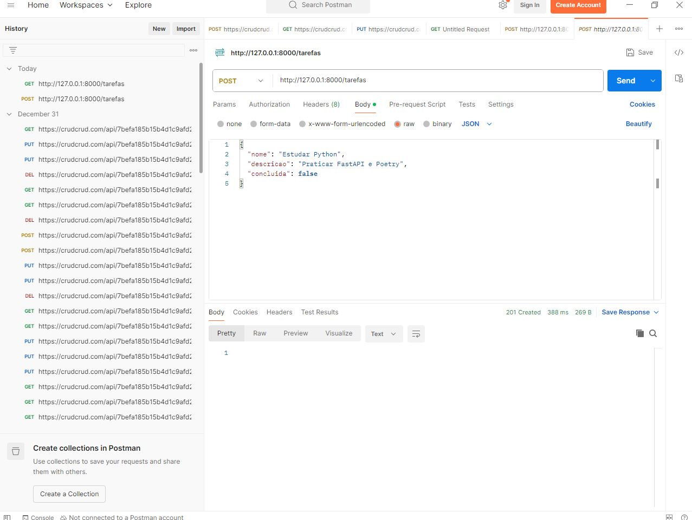
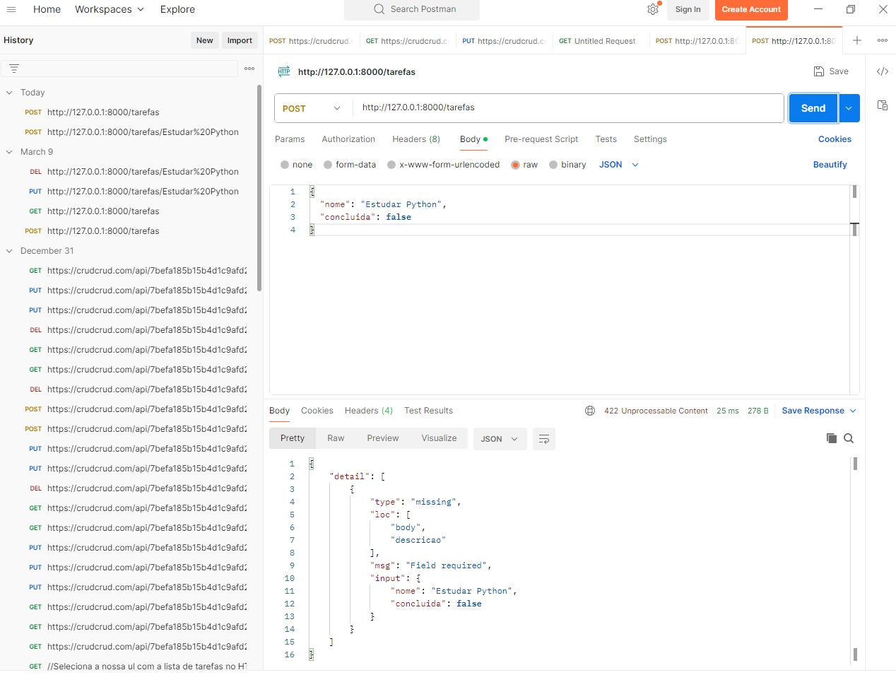
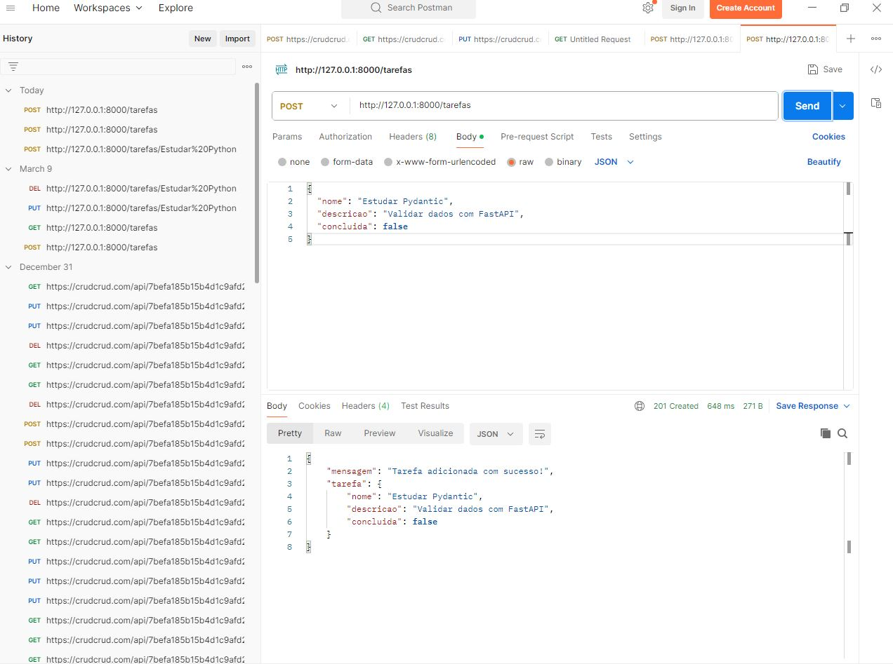
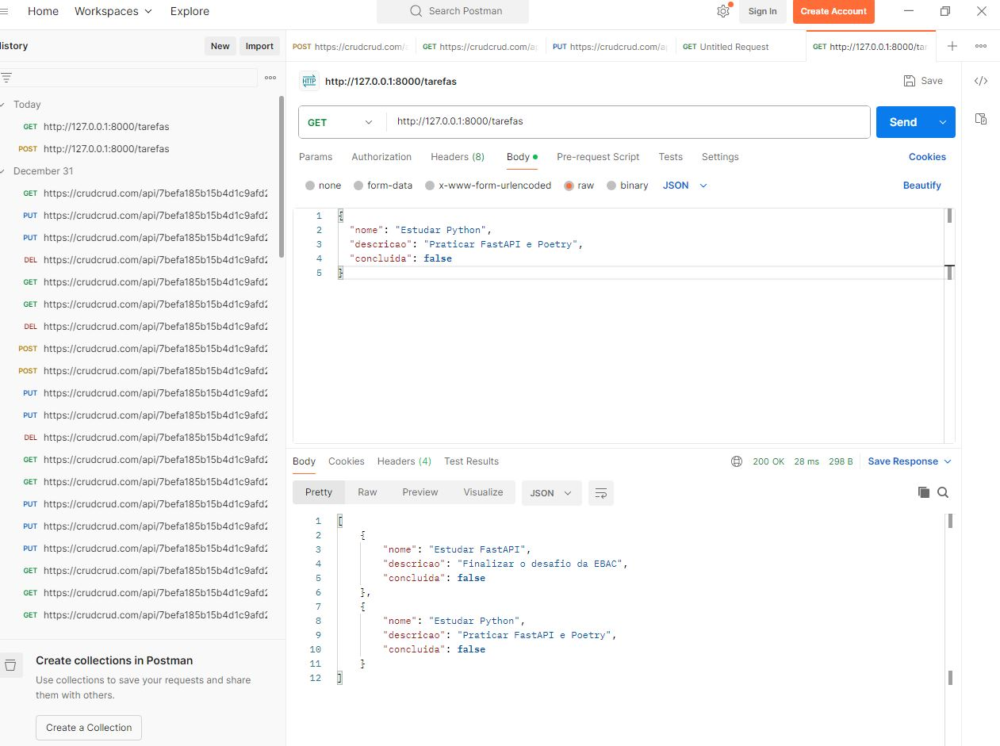
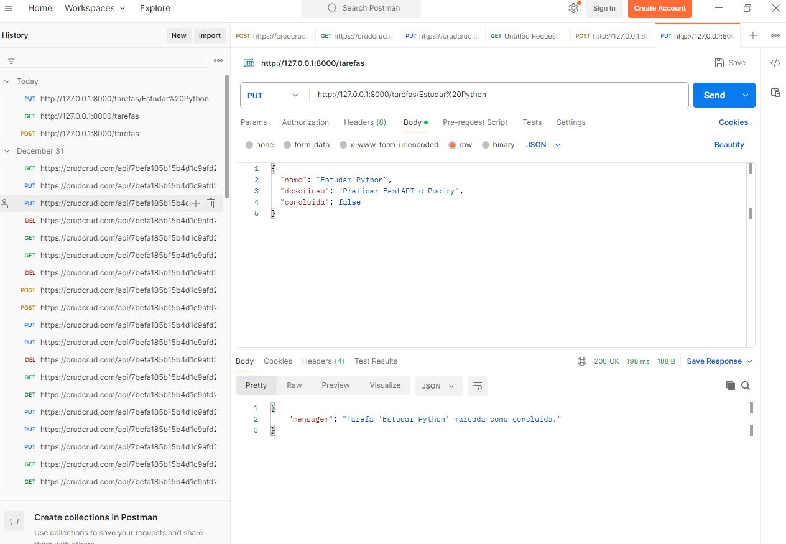
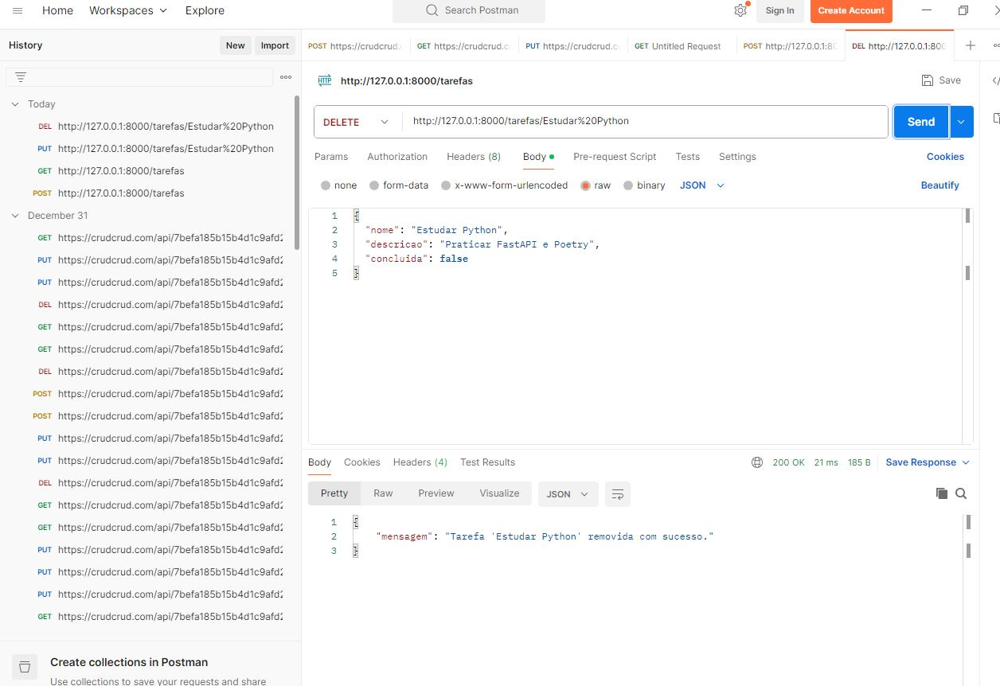

# 🚀 Gerenciador de Tarefas com FastAPI

Este projeto é uma API para gerenciamento de tarefas (To-Do List), desenvolvida para o curso Backend em Python da **EBAC**. A aplicação foi construída com **FastAPI** e validada utilizando o **Postman**.

## 🛠️ Tecnologias Utilizadas

* **Python**
* **FastAPI**: Framework web de alta performance.
* **Poetry**: Gerenciamento de dependências e ambiente virtual.
* **Pydantic**: Validação de esquemas de dados. Utilizado para modelagem e validação rigorosa de dados (Data Validation).

## 📋 Funcionalidades

* **POST** `/tarefas`: Adiciona uma nova tarefa (Nome e Descrição).
* **GET** `/tarefas`: Lista todas as tarefas cadastradas.
* **PUT** `/tarefas/{nome}`: Marca uma tarefa como concluída.
* **DELETE** `/tarefas/{nome}`: Remove uma tarefa da lista.
Validação Automática: A API valida se os campos obrigatórios (nome e descricao) foram enviados corretamente antes de processar a requisição.

## 🚀 Como Instalar e Rodar

1. **Clone o repositório:**
   ```bash
   git clone https://github.com/Li-code1/meu-gerenciador-tarefas-python.git
   cd seu-repositorio

```

2. **Instale as dependências com o Poetry:**
```bash
poetry install

```


3. **Inicie o servidor:**
```bash
poetry run uvicorn app:app --reload

```


O servidor estará rodando em: `http://127.0.0.1:8000`

## 🧪 Testando com Postman

Para testar as rotas conforme os requisitos do desafio, siga os passos abaixo no **Postman**:

### 1. Criar uma Tarefa (POST)

* **URL:** `http://127.0.0.1:8000/tarefas`
* **Body:** Selecione `raw` e o formato `JSON`.
* **Exemplo de JSON:**
```json
{
  "nome": "Estudar Python",
  "descricao": "Praticar FastAPI e Poetry",
  "concluida": false
}

```
"Caso tente enviar um JSON sem o campo nome ou descricao, a API retornará um erro 422, demonstrando a robustez da validação com Pydantic."


### 2. Listar Tarefas (GET)

* **URL:** `http://127.0.0.1:8000/tarefas`
* **Método:** GET (não precisa de corpo).

### 3. Concluir Tarefa (PUT)

* **URL:** `http://127.0.0.1:8000/tarefas/Estudar%20Python`
* **Método:** PUT.
* *Nota: O nome da tarefa vai direto na URL.*

### 4. Remover Tarefa (DELETE)

* **URL:** `http://127.0.0.1:8000/tarefas/Estudar%20Python`
* **Método:** DELETE.


## 🧪 Testes Realizados (Postman)

Abaixo estão as capturas de tela dos testes realizados conforme os requisitos do desafio:

| Operação | Print do Teste |
| :--- | :--- |
| **Adicionar Tarefa** |  |
  **Adicionar Tarefa, com erro (sem a descrição)** |  |
  **Adicionar Tarefa, com validação** |  |
| **Listar Tarefas** |  |
| **Concluir Tarefa** |  |
| **Remover Tarefa** |  |
---

Desenvolvido por **Liliane Lima** ✨

```

